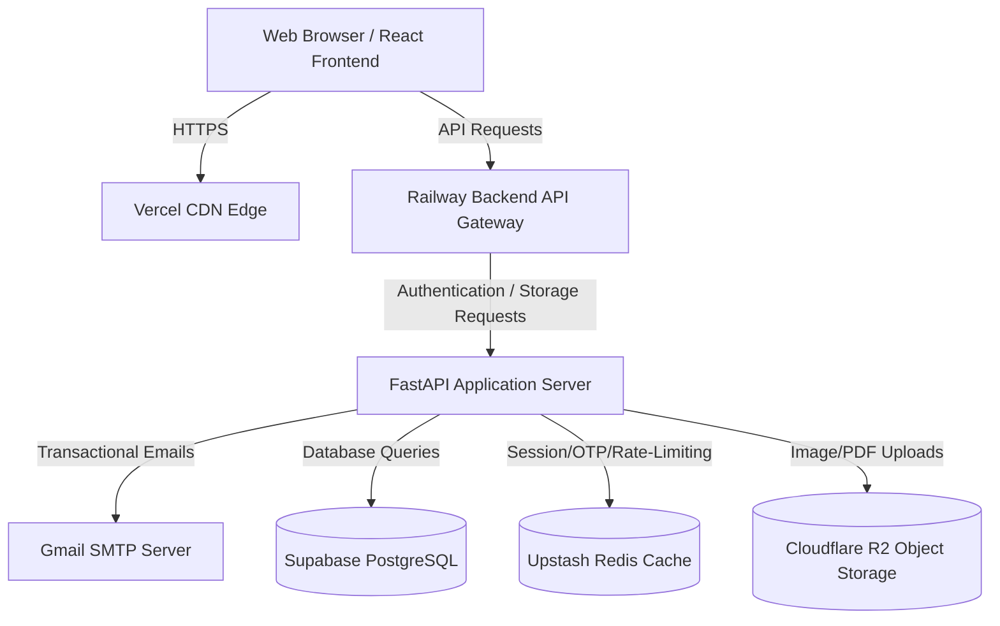

# System Architecture

This document describes the high-level architecture, service topology, and data flow of the **Embedded Collective & Portfolio** platform.

## Component Breakdown

1. **Frontend (Vercel)**
   - Deployed as a single-page application built with React, TypeScript, and Vite.
   - Hosted on Vercel's global CDN for low latency.
   - SPA routing is managed via `vercel.json` rewrite rules.

2. **Backend (Railway)**
   - Containerized FastAPI application deploying automatically via Nixpacks/Docker on Railway.
   - Exposes public and authenticated REST endpoints under `/api/v1`.
   - Incorporates custom ASGI middleware for rate-limiting, security headers, and structured logging.

3. **Database (Supabase PostgreSQL)**
   - Managed cloud PostgreSQL hosting.
   - Replaces local SQLite to support connection pooling, high concurrency, and data persistence.
   - Initialized and managed through Alembic database migrations.

4. **Caching & Queue Store (Upstash Redis)**
   - Serverless Redis instance for session state, rate limit token bucket storage, and verification OTP verification caching.
   - Accessed over secure TLS.

5. **Asset Storage (Cloudflare R2)**
   - S3-compatible serverless object storage bucket.
   - Replaces the local `uploads` directory.
   - Used for storing user avatars, contributor resume PDFs, and question attachments.
   - Configured with custom domains for direct CDN delivery.

## Key Data Flows

- **Social Login**: OAuth callback handshake with Google Authentication APIs → Access verification on backend → Token generation (JWT Access & HTTP-Only Refresh) → Local Storage & Redis session sync.
- **Resource Upload**: User submits image/PDF → Base64 validation and size limitations checked on FastAPI router → Direct stream upload to Cloudflare R2 bucket → Attachment record stored in Supabase PostgreSQL → Signed URL returned to Client.
- **OTP Verification**: OTP code generation → Code saved in Redis under `otp:{target}` with a 5-minute TTL → Code dispatched to SMTP/Twilio → User verifies OTP → Match results in token grant and Redis cleanup.
